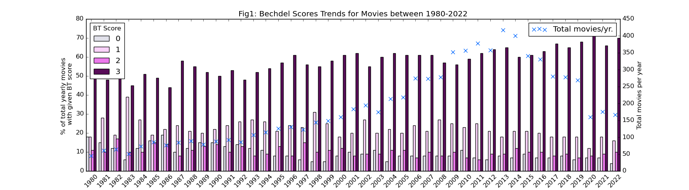
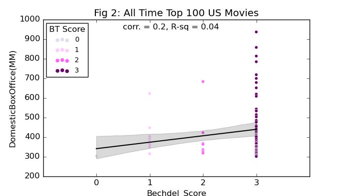

## 
 Female Character Development in Movies - An Analysis using Bechdel Score 

<b>Project background:</b> Happy Pride Month!! I originally wanted to analyze LQBTQIA+ presentation in Hollywood but wasn't able to find any freely available data on this. For example, glaad.org has this great [report](https://glaad.org/whereweareontv21) but unfortunately, the data behind the report is not freely available. So I'm focusing instead on gender based representation since this data is pretty easily available from [thebechdeltest](https://bechdeltest.com/). 

The Bechdel-Wallace Test or [(The Rule)](https://dykestowatchoutfor.com/the-rule/) as it was referred to by Alison Bechdel in the comic strip she created in 1985, asks three questions: (1) Are there at least two female characters in the movie?, (2) Are they shown talking to each other?, and (3) About something other than a man? The Bechdel-Wallace test has come to be one of the more well-known measures of female representation. Over the years, others have added further criteria to the test; this article by [ThirtyFiveEighty](https://projects.fivethirtyeight.com/next-bechdel/) talks about some of them. To keep things simple for my project, I'd like to stick to Bechdel scores.

<b>Datasets:</b> Three main datasets have been used for this project - (1) from [thebechdeltest.com](https://bechdeltest.com/api/v1/doc#getAllMovies), (2) from [imdb.com](https://developer.imdb.com/non-commercial-datasets/), and (3) from [the-numbers.com](https://www.the-numbers.com/box-office-records/domestic/all-movies/cumulative/all-time).

<b>Project Goals:</b> In this project I'm mainly asking the following questions:

* Using the Bechdel Test as a benchmark for representation of female characters in movies, do we see trends improving or deteriorating in Hollywood?

* Does the audience care; do movies that pass the Bechdel Test do better at the box office?

<b>Key Observations:</b>

For the first project goal, I'm happy to report that we see positive trends. Female representation in movies is appears to be improving over the years per the  Bechdel dataset as shown in Fig. 1 below. 

However, the Bechdel dataset does not represent the full universe of Hollywood movies; the Bechdel dataset is created based on [user submissions](https://bechdeltest.com/add/) and it is possible that only movies that do well on the Bechdel test are being reported. This would cause the Bechdel dataset to be biased and in such a case, the positive trends we see in this dataset may not converge with a broader and more representative dataset of Hollywood movies. See Module 2 of the project code for further details on how the representativeness of the Bechdel dataset based on a comparison against the IMDB dataset of US based English movies. Only 20% of the movies from the IMDB dataset were also found in the Bechdel dataset which would indicate that the Bechdel dataset is not fully representative of the universe of Hollywood movies from 1980 to 2022.

For the second project goal, in terms of box office returns, an analysis of the all time top 100 US movies by domestic box office returns revealed that 73% of these movies pass the Bechdel Test. While there are likely a lot of factors that go into making a movie a success, such as the budget, plot/genre, cast, etc. (analysis of which is beyond the scope of this project due to time and resource constraints), it appears that Bechdel scores are not strongly correlated with box office returns (correlation = ~0.2).

  

