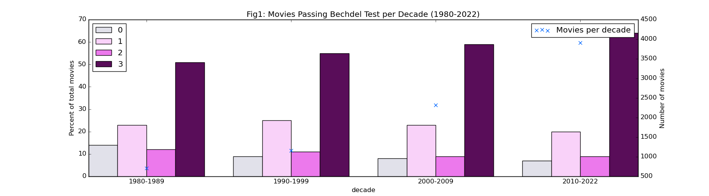
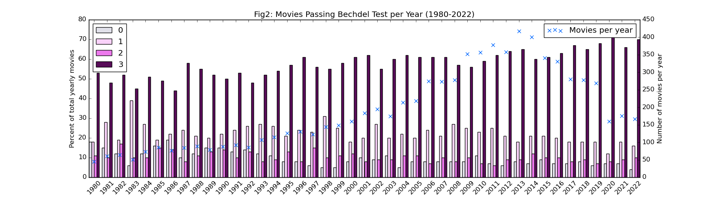
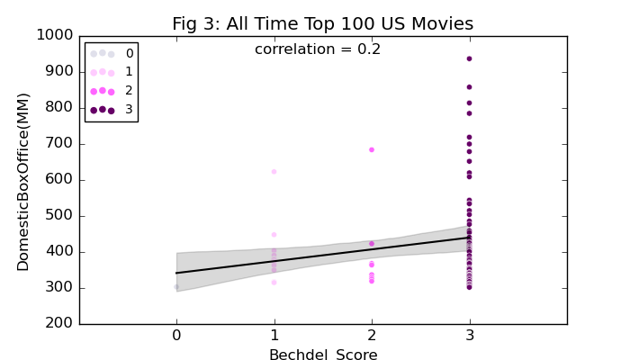

## 
Female Character Develoment in Movies - An Analysis using Bechdel Scores

    
<b>Project background:</b> Happy Pride Month!! I originally wanted to analyze LQBTQIA+ presentation in Hollywood but wasn't able to find any freely available data on this. For example, glaad.org has [this great report](https://glaad.org/whereweareontv21) but unfortunately, the data behind the report is not freely available. So I'm focusing instead on gender based representation since this data is pretty easily available from [thebechdeltest](https://bechdeltest.com/). 

The Bechdel-Wallace Test or [(The Rule)](https://dykestowatchoutfor.com/the-rule/) as it was referred to by Alison Bechdel in the comic strip she created in 1985, asks three questions: (1) Are there atleast two female characters in the movie?, (2) Are they shown talking to each other?, and (3) About something other than a man? The Bechdel-Wallance test has come to be one of the more well-known measures of female representation. Over the years, others have added further criteria to the test; this article by [ThirtyFiveEighty](https://projects.fivethirtyeight.com/next-bechdel/) talks about some of them. To keep things simple for my project, I'd like to stick to bechdel scores.

In this project I'm mainly asking the following questions:

* Using the Bechdel Test as a benchmark for representation of female characters in movies, do we see trends improving or deteriorating in Hollywood?

* Does the audience care; do movies that pass the Bechdel Test do better at the box office?

I'm happy to report that we see positive trends; female representation in movies is improving over the years as shown in Figures 1 and 2 below. However, as analyzed in the project details section, unfortunately, the Bechdel dataset does not represent the full universe of Hollywood movies; [the Bechdel dataset is created based on user submissions](https://bechdeltest.com/add/) and it is possible that individuals who report back to the website are more likley to watch movies that would do well on such a test anyway, which may potentially instroduce some positive bias in the dataset. So the positive trends we see in this dataset may not converge with a broader and more representative dataset of Hollywood movies.

In terms of box office returns, an analysis of the all time top 100 US movies by domestic box office returns revealed that 73% of these movies pass the Bechdel Test as shown in Figure 3. But the ability of a movie to pass the bechdel test does not have much predictive power about whether the movie will be a top grosser or not as shown in Table 1.

  

  

